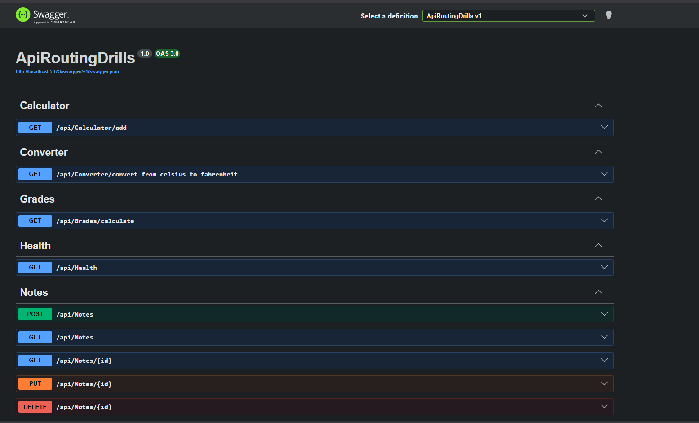
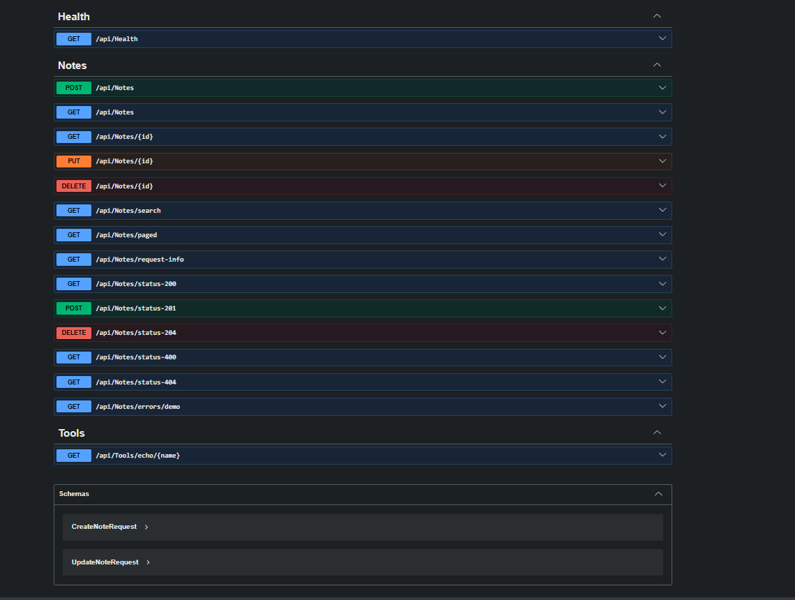

# Task 01: REST Routing Drills

This folder contains the setup for Web API routing drills in ASP.NET Core.

## Project Structure
- `ApiRoutingDrills/`: The ASP.NET Core Web API project.
  - `Controllers/`: Contains the API endpoints organized by domain.
    - `HealthController.cs`: Health check endpoint.
    - `ToolsController.cs`: Endpoints demonstrating route parameters, query strings, request headers, and status codes.
    - `CalculatorController.cs`: Mathematical calculation endpoints.
    - `NotesController.cs`: A CRUD API representation for notes.
    - `ConverterController.cs`: Temperature conversion API.
    - `GradesController.cs`: Grade API endpoints.
  - `Models/`: Domain models used within the application.
  - `DTOs/`: Data Transfer Objects used by the endpoints.
  - `Services/`: Business logic services.

## Drills Included
- [x] Drill 01: Health Check Endpoint
- [x] Drill 02: Route Parameter Echo
- [x] Drill 03: Query String Calculator
- [x] Drill 04: Temperature Conversion API
- [x] Drill 05: Grade API
- [x] Drill 06-12: Notes CRUD, Pagination, and Search
- [x] Drill 13: Header Reader Endpoint
- [x] Drill 14: Status Code Practice
- [x] Drill 15: Standard Error Shape

## 📸 Screenshots & Demos
> **Note to self:** Replace these placeholders with actual image links before submitting.
- **Swagger UI Overview:**  
