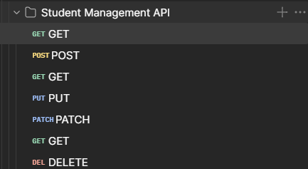
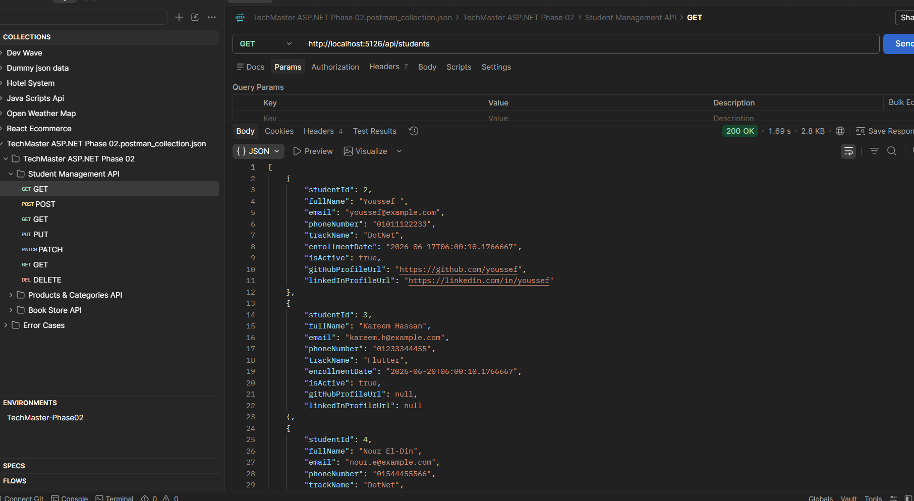

# Task 02: Student Management API

This folder contains the Student Management API project.

## Overview
A robust ASP.NET Core Web API designed for managing student records. It demonstrates CRUD operations, proper model structuring, and standard API practices.

## 📸 Screenshots & Demos
- **Swagger UI Overview:** ``
- **Postman Testing:** 
    