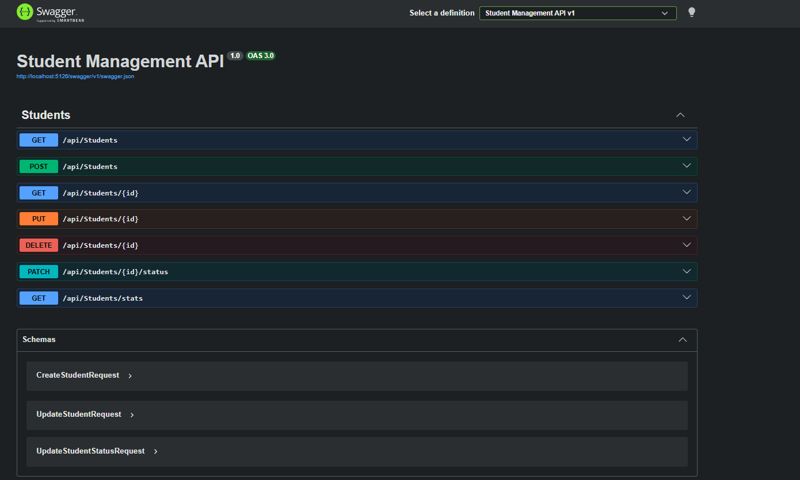

# Task 02: Student Management API

A robust ASP.NET Core Web API for managing student records.

## Features
*   **CRUD Operations:** Full Create, Read, Update, and Delete functionality for student records.
*   **Database Integration:** Fully integrated with **SQL Server** using **Entity Framework Core**.
*   **Asynchronous Endpoints:** All API endpoints and database queries utilize `async/await` for high performance and scalability.
*   **Dependency Injection:** Clean architecture using scoped services for database access.
*   **Swagger UI:** Interactive API documentation available at `/swagger`.

## Technologies Used
*   .NET 10.0
*   ASP.NET Core Web API
*   Entity Framework Core (SQL Server)
*   Swagger / OpenAPI

## Setup & Running
1.  **Configure Database:** Update the `DefaultConnection` string in `appsettings.json` to point to your SQL Server instance.
2.  **Apply Migrations:** If the database doesn't exist, run `dotnet ef database update` to create the database schema.
3.  **Run the API:** Start the project using `dotnet run` or through your IDE (Visual Studio/Rider).
4.  **Explore API:** Navigate to `https://localhost:<port>/swagger` to interact with the endpoints.

## 📸 Screenshots & Demos
- **Swagger UI Overview:** 
- **Postman Testing:** 
- **Postman Testing 2:** 