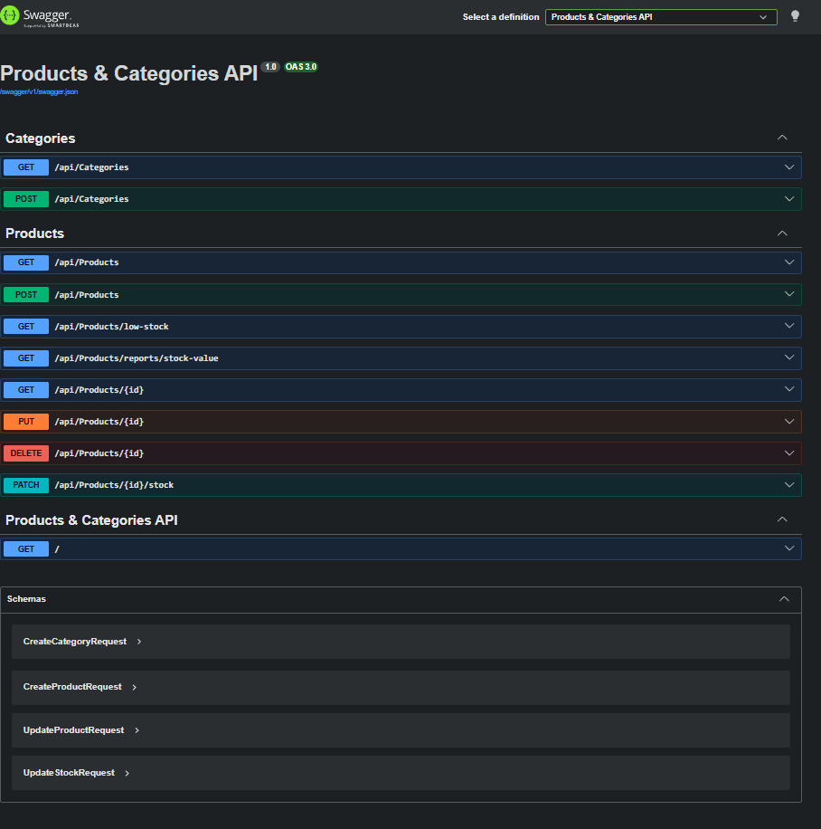
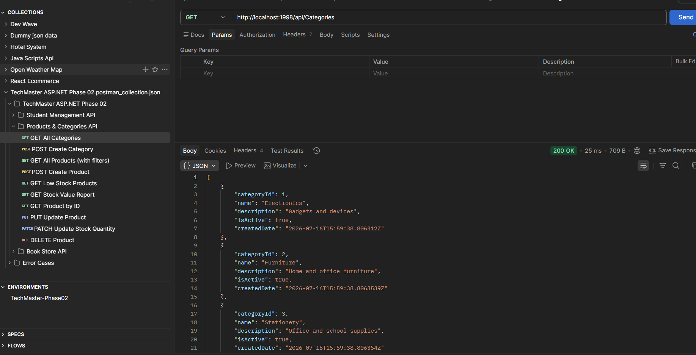

# Task 03: Products & Categories API

This folder contains the Products & Categories API project.

## Overview
Developed a Web API to manage products and categories, showcasing relationships between entities and standard HTTP verbs for interacting with the resources.

## 📸 Screenshots & Demos
> **Note to self:** Replace these placeholders with actual image links before submitting.
- **Swagger UI Overview:** 
- **Postman Testing:** 
