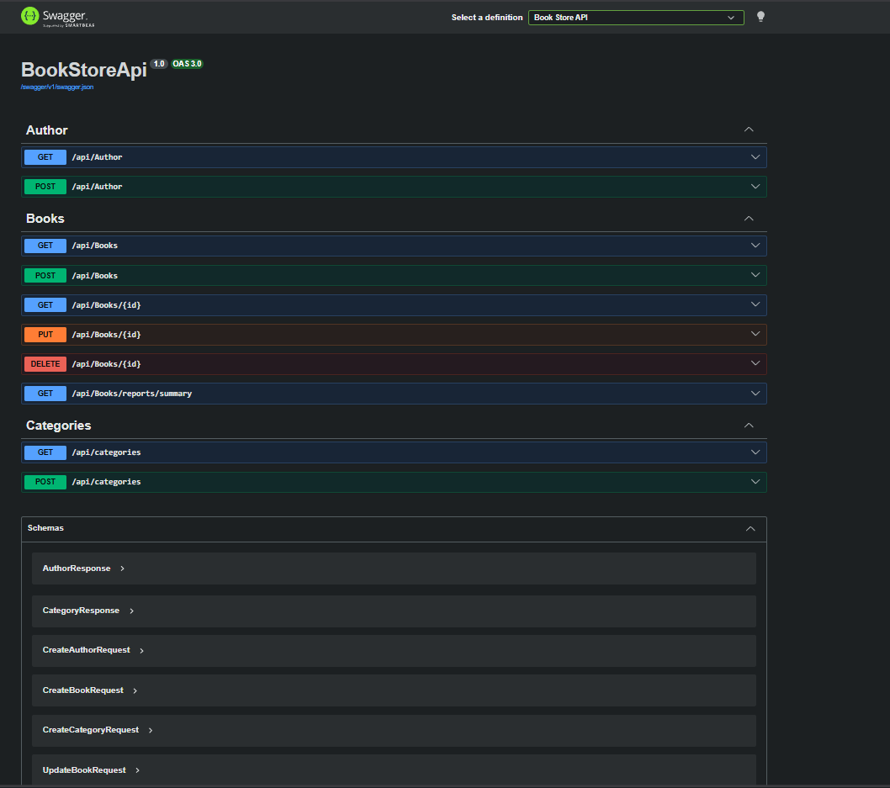
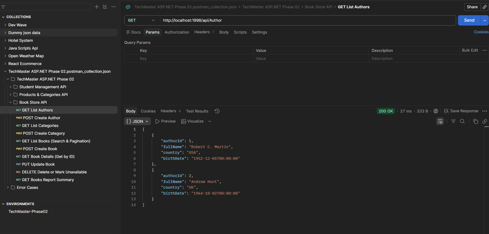

# Task 04: Book Store API

This folder contains the Book Store API project.

## Overview
An API for managing a bookstore's inventory. Includes endpoints for adding, updating, retrieving, and deleting books, implementing proper HTTP status codes and API design principles.

## 📸 Screenshots & Demos
> **Note to self:** Replace these placeholders with actual image links before submitting.
- **Swagger UI Overview:** 
- **Postman Testing:** 
