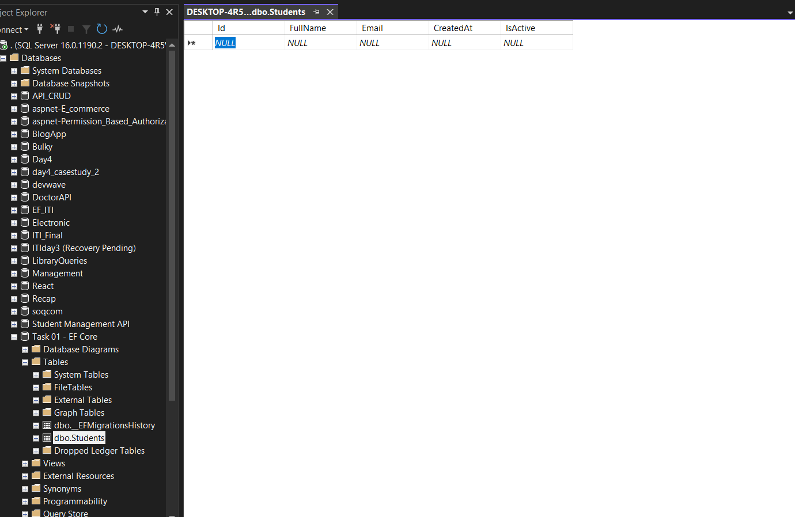
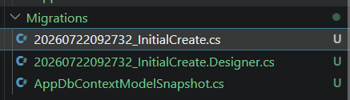

# Drill 01: DbContext and First Migration

## Database Table and Migration Files

### Migration Files
 

### Database Table

## Concepts Explained

### DbContext
`DbContext` is the primary class that coordinates Entity Framework Core functionality for your data model. It acts as a bridge or a session between your C# application and the database. It is responsible for:
- Connecting to the database.
- Tracking changes made to entities.
- Managing database transactions.
- Translating LINQ queries into SQL queries that the database understands.

### DbSet
`DbSet<TEntity>` represents a collection of a specific entity type within the context (like a table in the database). For example, `DbSet<Student>` corresponds to the `Students` table. 
- You use `DbSet` to perform CRUD (Create, Read, Update, Delete) operations on your entities.
- Any LINQ queries you write against a `DbSet` will be automatically translated into the corresponding SQL queries by the `DbContext`.
