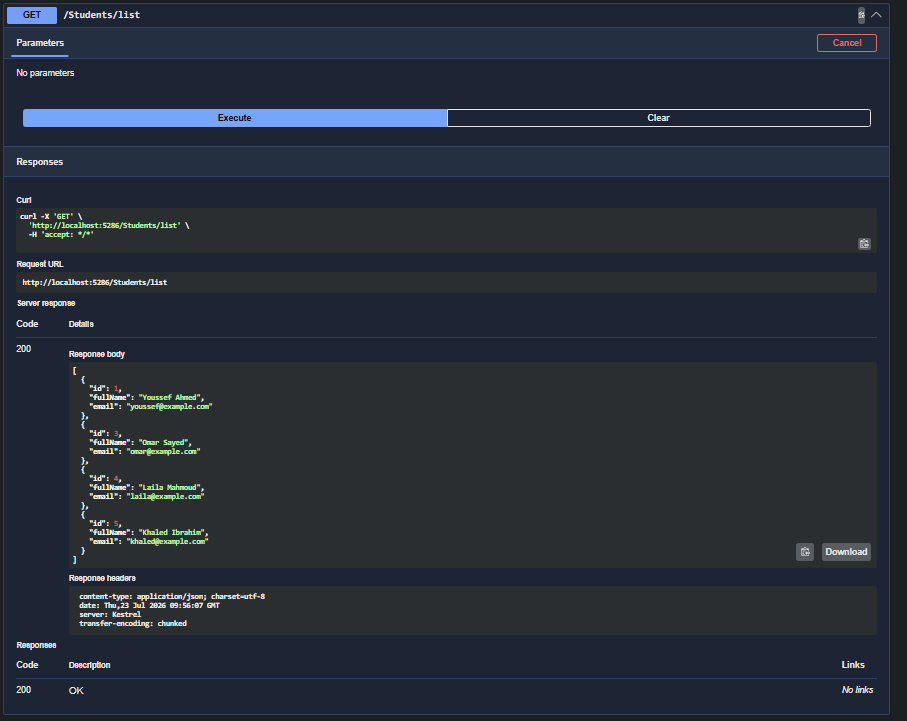
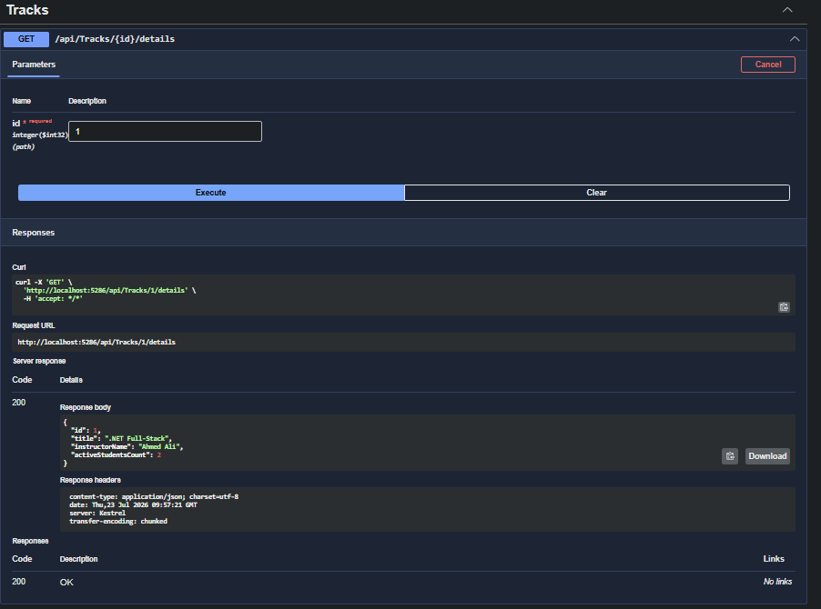

# **Drill 09 - Projection DTO Drill**

## Required Evidence

### Response Shape Screenshots

**Student DTOs**


**Track DTOs**


### Code Snippets

**StudentListItemDto**
```csharp
public class StudentListItemDto
{
    public int Id { get; set; }
    public string FullName { get; set; } = string.Empty;
    public string Email { get; set; } = string.Empty;
}
```

**TrackDetailsDto**
```csharp
public class TrackDetailsDto
{
    public int Id { get; set; }
    public string Title { get; set; } = string.Empty;
    public string InstructorName { get; set; } = string.Empty;
    public int ActiveStudentsCount { get; set; }
}
```