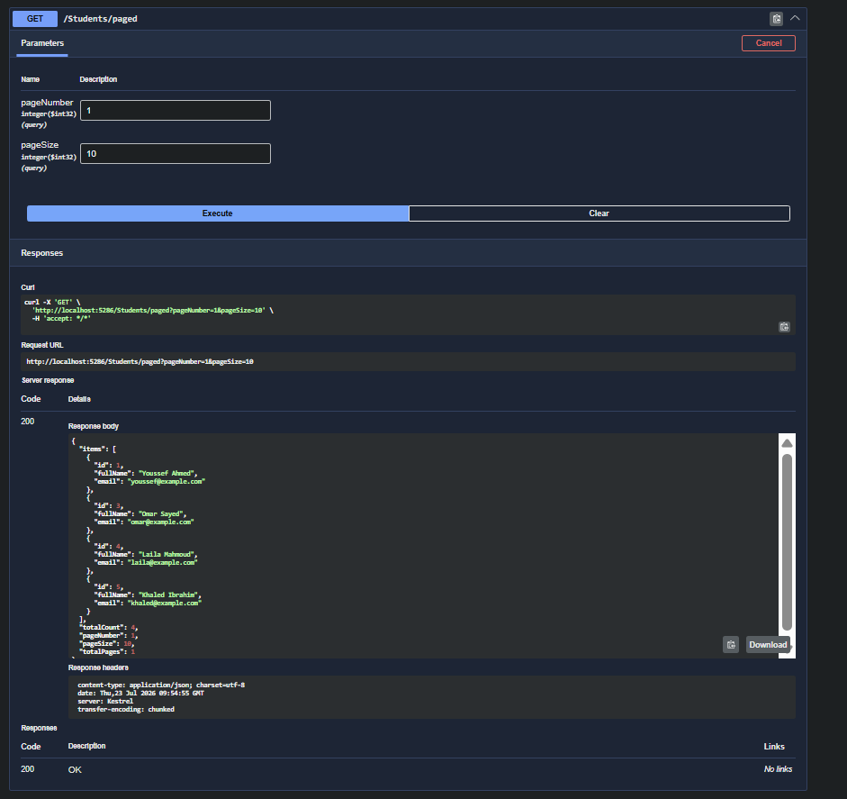

# **Drill 10 - Pagination Drill**

## Required Evidence

### Swagger Screenshot
<!-- Add your Swagger screenshot testing the pagination endpoint here -->

### Pagination Formula Explanation
The pagination is implemented using the `Skip` and `Take` methods in LINQ.
The formula to calculate the number of records to skip is:
`var skip = (pageNumber - 1) * pageSize;`

- **pageNumber**: The current page requested by the client (1-indexed).
- **pageSize**: The number of records to return per page.

By subtracting 1 from the `pageNumber`, we find how many pages came *before* the requested page. Multiplying that by the `pageSize` gives us the exact number of rows to skip.
For example, if `pageNumber = 2` and `pageSize = 10`, then `skip = (2 - 1) * 10 = 10`. We skip the first 10 records and `Take(10)` to get the second page.