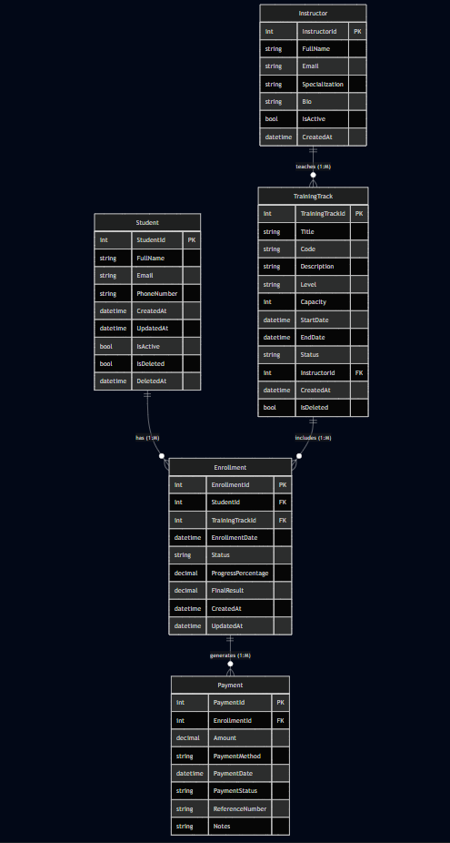

# Task 02 - ERD Deliverables

## 1. ERD Image

## 2. Tables List
The database consists of the following 5 tables:
1. **Instructor**: Stores information about track instructors.
2. **TrainingTrack**: Stores information about the various training tracks offered.
3. **Student**: Stores information about registered students.
4. **Enrollment**: A junction table that records which students are enrolled in which training tracks, along with their progress and status.
5. **Payment**: Records the payments made for specific enrollments.

## 3. Fields List

### Instructor
* `InstructorId` (Int): Unique identifier for the instructor.
* `FullName` (string): Instructor's full name.
* `Email` (string): Instructor's email address.
* `Specialization` (string): Instructor's area of expertise.
* `Bio` (string): Short biography of the instructor.
* `IsActive` (bool): Indicates if the instructor is currently active.
* `CreatedAt` (datetime): Timestamp of record creation.

### TrainingTrack
* `TrainingTrackId` (Int): Unique identifier for the training track.
* `Title` (string): Title of the track.
* `Code` (string): Unique code for the track (e.g., CS101).
* `Description` (string): Detailed description of the track.
* `Level` (string): Difficulty level (e.g., Beginner, Advanced).
* `Capacity` (Int): Maximum number of students allowed.
* `StartDate` (datetime): Start date of the track.
* `EndDate` (datetime): End date of the track.
* `Status` (string): Current status (e.g., Upcoming, Ongoing, Completed).
* `InstructorId` (Int): Identifier of the assigned instructor.
* `CreatedAt` (datetime): Timestamp of record creation.
* `IsDeleted` (bool): Soft delete flag.

### Student
* `StudentId` (Int): Unique identifier for the student.
* `FullName` (string): Student's full name.
* `Email` (string): Student's email address.
* `PhoneNumber` (string): Student's contact number.
* `CreatedAt` (datetime): Timestamp of record creation.
* `UpdatedAt` (datetime): Timestamp of the last update.
* `IsActive` (bool): Indicates if the student account is active.
* `IsDeleted` (bool): Soft delete flag.
* `DeletedAt` (datetime): Timestamp when the student was soft-deleted.

### Enrollment
* `EnrollmentId` (Int): Unique identifier for the enrollment record.
* `StudentId` (Int): Identifier of the enrolled student.
* `TrainingTrackId` (Int): Identifier of the track the student is enrolled in.
* `EnrollmentDate` (datetime): Date of enrollment.
* `Status` (string): Status of enrollment (e.g., Active, Completed, Dropped).
* `ProgressPercentage` (decimal): Student's progress in the track.
* `FinalResult` (decimal): Final grade or score.
* `CreatedAt` (datetime): Timestamp of record creation.
* `UpdatedAt` (datetime): Timestamp of the last update.

### Payment
* `PaymentId` (Int): Unique identifier for the payment.
* `EnrollmentId` (Int): Identifier of the related enrollment.
* `Amount` (decimal): Payment amount.
* `PaymentMethod` (string): Method of payment (e.g., Credit Card, Cash).
* `PaymentDate` (datetime): Date the payment was made.
* `PaymentStatus` (string): Status of the payment (e.g., Pending, Completed).
* `ReferenceNumber` (string): External transaction reference number.
* `Notes` (string): Any additional payment notes.

## 4. PK/FK List

* **Instructor**:
  * PK: `InstructorId`
* **TrainingTrack**:
  * PK: `TrainingTrackId`
  * FK: `InstructorId` (References `Instructor.InstructorId`)
* **Student**:
  * PK: `StudentId`
* **Enrollment**:
  * PK: `EnrollmentId`
  * FK: `StudentId` (References `Student.StudentId`)
  * FK: `TrainingTrackId` (References `TrainingTrack.TrainingTrackId`)
* **Payment**:
  * PK: `PaymentId`
  * FK: `EnrollmentId` (References `Enrollment.EnrollmentId`)

## 5. Relationship Explanation

1. **Instructor - TrainingTrack (1:M)**
   An `Instructor` can teach multiple `TrainingTrack`s, but each `TrainingTrack` is assigned to exactly one `Instructor` (represented by `InstructorId` in `TrainingTrack`).
2. **Student - Enrollment (1:M)**
   A `Student` can have multiple `Enrollment`s (enrolled in multiple tracks), but each `Enrollment` belongs to a single `Student`.
3. **TrainingTrack - Enrollment (1:M)**
   A `TrainingTrack` can have multiple `Enrollment`s (many students enrolled), but each `Enrollment` belongs to a specific `TrainingTrack`. 
   *(Note: Together, Student and TrainingTrack form a Many-to-Many relationship, which is resolved by the `Enrollment` junction table.)*
4. **Enrollment - Payment (1:M)**
   An `Enrollment` can generate multiple `Payment`s (e.g., if a student pays in installments). Each `Payment` is tied to exactly one `Enrollment`.

## 6. Business Questions

The database schema is designed to answer the following key business questions:

1. **Which students are enrolled in a specific track?**
   (Join `Student` and `Enrollment` filtered by `TrainingTrackId`)
2. **Which tracks have available seats?**
   (Compare `TrainingTrack.Capacity` with the count of related `Enrollment`s)
3. **Which enrollments are unpaid?**
   (Check `Enrollment`s without related `Payment`s or where total `Payment.Amount` is less than the required track cost)
4. **How much revenue did each track generate?**
   (Sum `Payment.Amount` grouped by `TrainingTrackId` via `Enrollment`)
5. **Which instructor has the highest workload?**
   (Group by `InstructorId` and count the number of active `TrainingTrack`s)
6. **Which students have active enrollments?**
   (Filter `Enrollment.Status` for 'Active' and join with `Student`)
7. **Which tracks start this month?**
   (Filter `TrainingTrack.StartDate` by the current month and year)
8. **What is the payment history for an enrollment?**
   (Select from `Payment` filtered by a specific `EnrollmentId` ordered by `PaymentDate`)
9. **Which tracks are full?**
   (Identify `TrainingTrack`s where the count of related `Enrollment`s equals or exceeds `Capacity`)
10. **How many enrollments exist by status?**
    (Group by `Enrollment.Status` and count)

## 7. Design Decisions (README)

* **Soft Deletes**: Implemented `IsDeleted` and `DeletedAt` fields in the `Student` and `TrainingTrack` tables. This allows recovering accidentally deleted records and preserves historical data integrity (e.g., keeping track of a student's past enrollments even if their account is deactivated).
* **Audit Trails**: Added `CreatedAt` and `UpdatedAt` timestamps across tables (like `Student` and `Enrollment`) to track when records are created and modified, which is crucial for troubleshooting and auditing.
* **Many-to-Many Resolution**: The relationship between Students and Training Tracks is inherently many-to-many. This was resolved by introducing the `Enrollment` junction table, which also sensibly holds enrollment-specific state such as `EnrollmentDate`, `Status`, `ProgressPercentage`, and `FinalResult`.
* **Payments Flexibility**: Modeled `Payment` as a separate table linked to `Enrollment` in a one-to-many relationship instead of adding a single payment status to `Enrollment`. This supports complex billing scenarios like installments, partial payments, and tracking payment methods (`PaymentMethod`, `ReferenceNumber`).
* **Data Types for Calculation**: `ProgressPercentage` and `FinalResult` in the `Enrollment` table, as well as `Amount` in the `Payment` table, use `decimal` to ensure high precision in grades and financial calculations, preventing rounding errors.